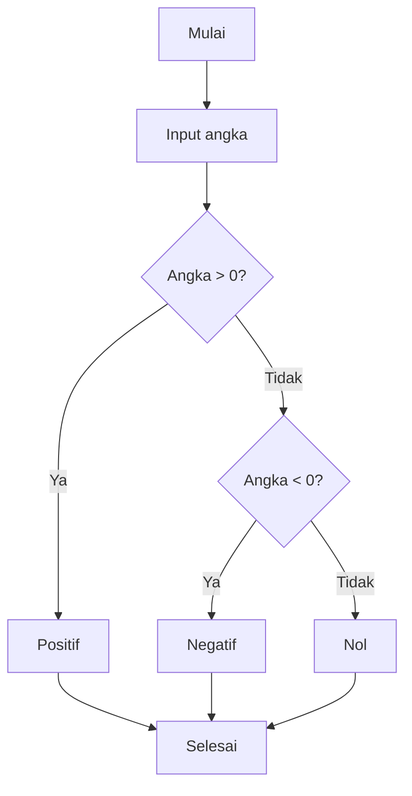

```mermaid
flowchart TD
    A[Mulai]
    B[Input angka]
    C{Angka > 0?}
    D[Positif]
    E{Angka < 0?}
    F[Negatif]
    G[Nol]
    H[Selesai]
    
    A --> B --> C
    C -- Ya--> D --> H
    C -- Tidak --> E
    E -- Ya --> F --> H
    E -- Tidak --> G --> H
```    
